# eCarma Assignment Task

I Kartik Manish Chawda, submitting my 80% completed task assignment. I have attached demo video link and screenshots of developed app.

### [Resume](https://drive.google.com/file/d/1SxvGQMEVtbQiHcxEHhMR1zYGyuGuJeaq/view?usp=sharing)

### [Video Demo](https://drive.google.com/file/d/1l198qUheOeOulGtF58lZfF0YrcqKAyhX/view?usp=sharing)

## Implemented Screenshots

- Splash Screen  
  [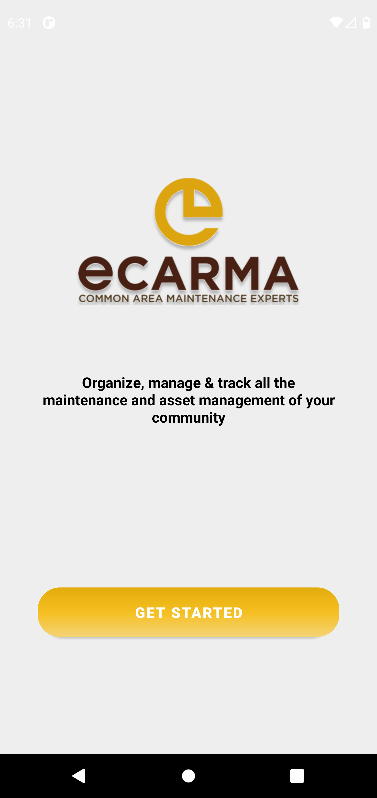](./readme/ecarma_splash.png)

- Register Screen  
  [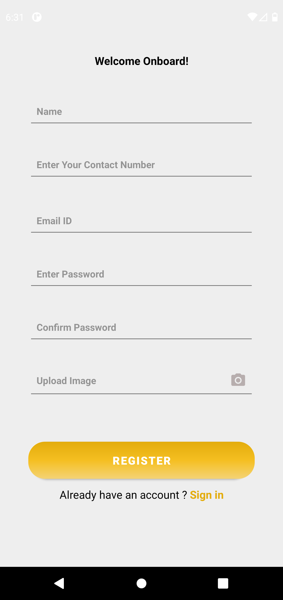](./readme/ecarma_register.png)

- Login Screen  
  [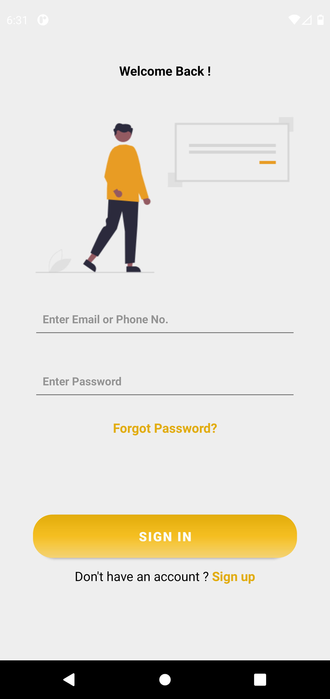](./readme/ecarma_login.png)

- Main Screen  
  [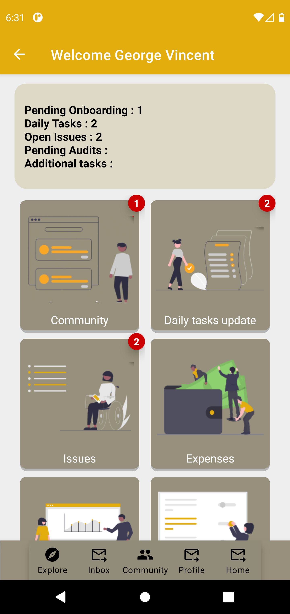](./readme/ecarma_mainscree.png)

- Community Screen 
  [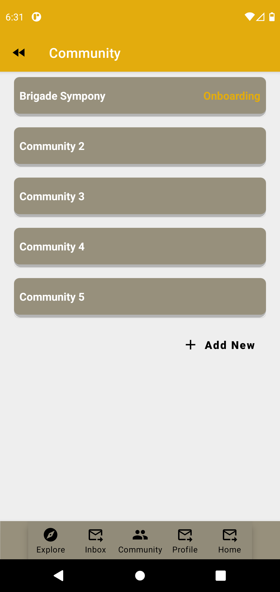](./readme/ecarma_community.png)

- Add Community Detail Screen 
  [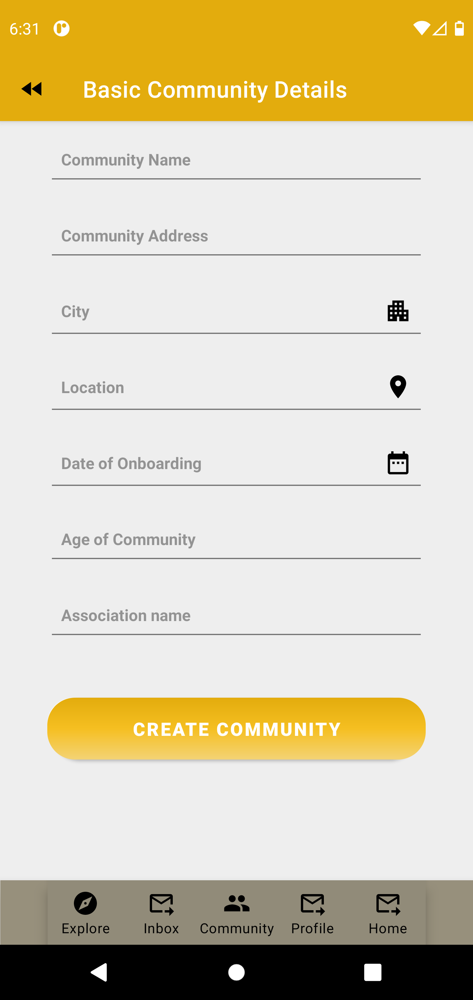](./readme/ecarma_add_community.png)

- Community Detail Screen  
  [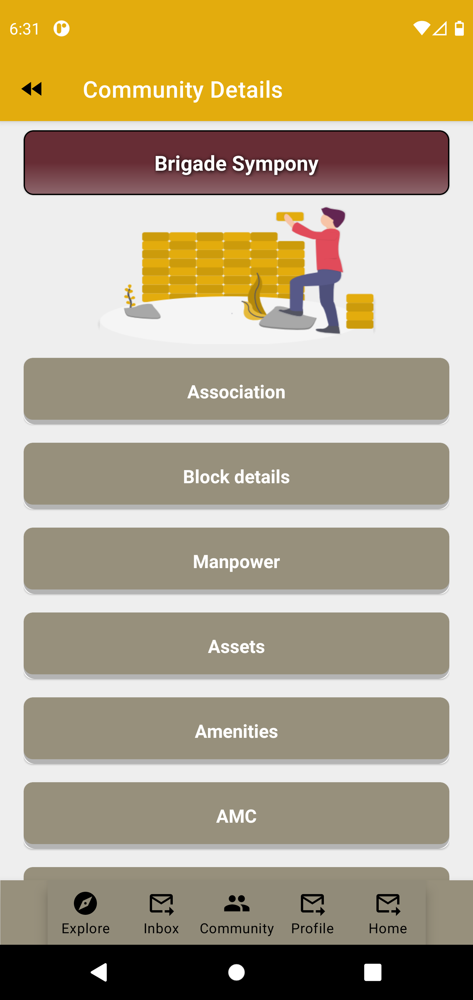](./readme/ecarma_community_detail.png)

- Association Detail Screen  
  [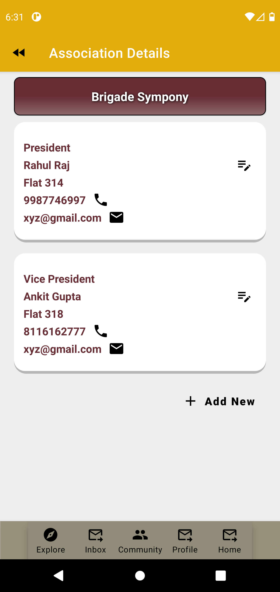](./readme/ecarma_association.png)

- Add Association Screen  
  [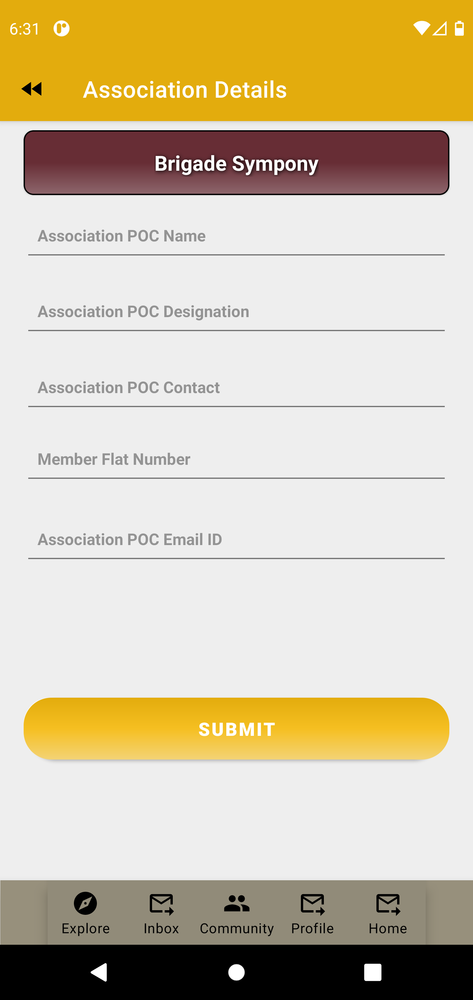](./readme/ecarma_add_association.png)

- Block Detail Screen  
  [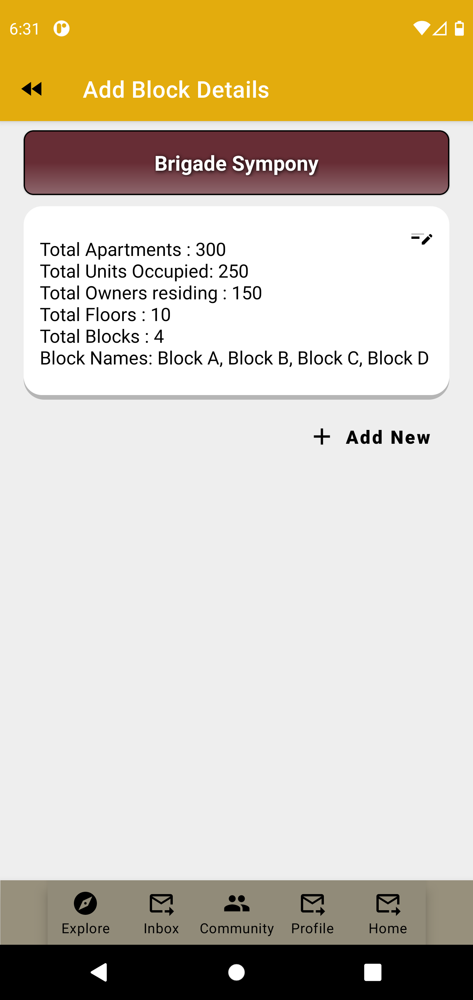](./readme/ecarma_block_detail.png)

- Add Block Detail Screen  
  [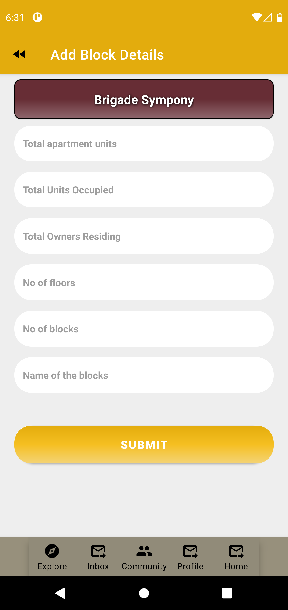](./readme/ecarma_add_block.png)

## Yet to Implement!

Screens not implemented are:

- Manpower Detail Screen
- Profile Icon on toolbar
